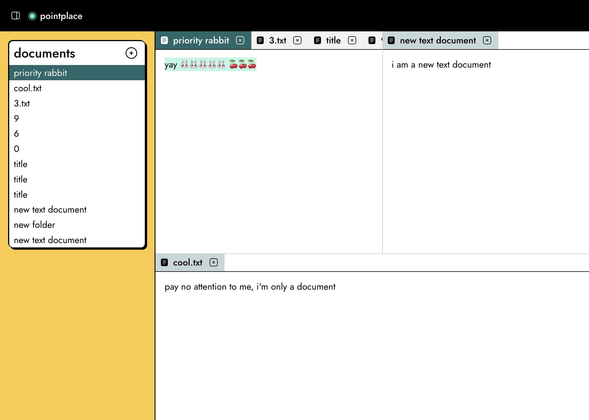

hello, world!

this week **zippers** came over and stayed a lil while, an exceptionally good
time. i cooked a sort of lebanese sort of chili. it was nice and with lamb and
green lentils. we went to work and ate it at the yellow sofa. we tried to go to
an exhibition but we wandered around barbican instead and it was very nice. on
the way home i got coughed and spluttered on by strangers. the next day i
started to feel a little under the weather so went home early and worked from
there.

it feels so nice to surprise somebody by taking work off their plate.

the convalescence continues, i'm still a little sicky now, haven't been out much
this weekend except meal deal shopping at the local ✨**Meal Deal Merchant**✨.

you may have noticed notice i've rewritten the code that runs my blog. sorry to
alice if i've broken [my rss feed](/feed.xml) again. i probably have. i've put a
silly amount of work into making it that old posts are rendered using the old
css and javascript, so they look the same and keep working. it's great.
especially how they still work when they're in a list.

i've also written my own pagination function so that the past is `previous` to
the future. it surprised me that it's not the default for chronological content,
i looked around to see if anyone else has ever thought much about it. i found [a
post from a decade ago by chris
coyier](https://css-tricks.com/musings-on-paginating-chronological-content/).

he points out another cool detail:

> The benefits of this is that creating new content doesn’t shift the entire
> pagination structure. Next week after five more articles are published, the
> “Older Posts” button just goes to “321” instead of “320”. That means that all
> incoming links and bookmarks are preserved, and search engines will find the
> same content at the same URLs forever.

so now my page does that, too. because that's
[cool](https://www.w3.org/Provider/Style/URI)!

---

it's nice when you throw something together with stuff you have in the fridge
and it just turns out to be so fancy. today some leftovers meant a [greek yoghurt
omelette](/2024/01/28/yrs-23-wks-4/) with parsley, muchroom, smoked salmon and cream cheese.

---

it's fun to have fun.

---

i've also made this new https://quietparty.net/ website. and i have started
working on a littlebook-adjacent app. it's lookin good. collaborative, docks,
filetypes. all the same thing but from scratch with my solid lib. getting
further faster this time.

okay i'm hungry now for dinner, so let's have dinner. hope i'm well enough
tomorrow to work

---

was hoping to make a little music for this post because i want to show off my
new button, but i am not feeling particularly musical today and keep making
complete trash. instead i've included my least popular (c/o spotify) track off
my most popular (and only!) release of last year.
